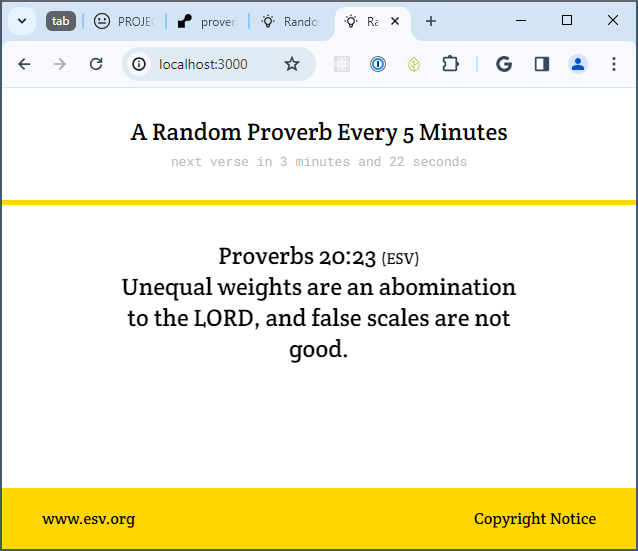

# Random Proverb

[Random Proverb](https://proverbs.onrender.com/) displays a single random proverb from the book of Proverbs every 5 minutes. Not all proverbs are included. The randomly chosen proverbs are from chapters 10-22 and chapters 26-29. Proverbs that contain more than one verse were excluded. A proverb that was displayed once is not repeated until every proverb on the list has been displayed, after which the cycle resets. The verses were fetched from the [ESV API](https://api.esv.org/).

This project was made with `node.js`, `express`, `request`, and `socket.io`.

:warning: It may take a few minutes to load for the first time.

# License

ISC
